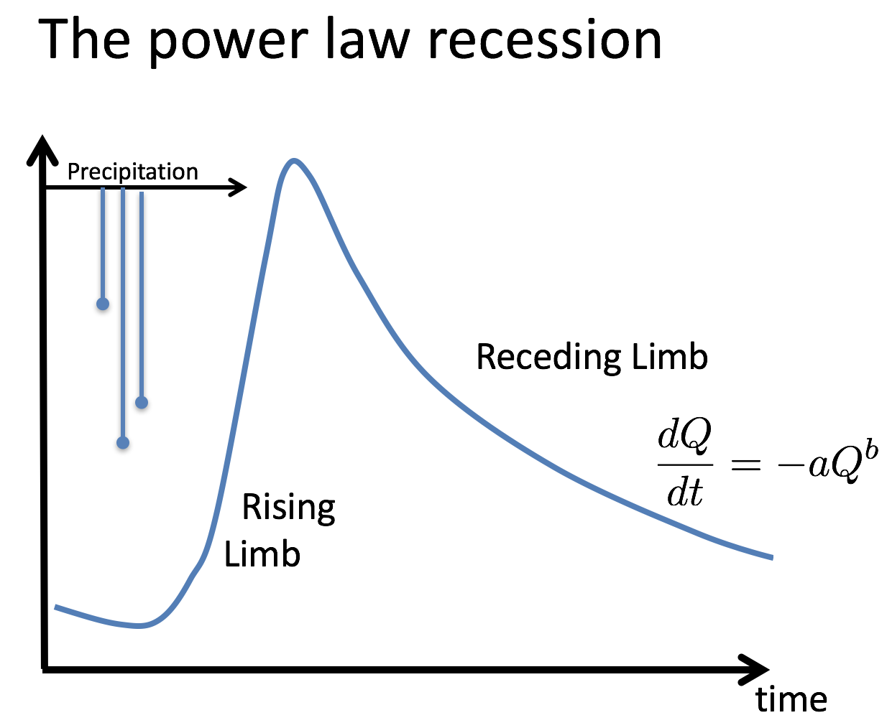

# Recession Analyzer

## Table of Contents

- [Background](#background)
	- [References](#references)
- [Usage](#usage)
	- [Model parameters](#recessionanalyzerparameters)

## Background

Between rainfall events, watersheds enter a recession phase, during which stream flows (Q) decline. The rate of recession depends strongly on catchment physiographic features (e.g. landscape relief, or soil type), and has important consequences for availability of surface water for ecosystems and society. One common mathematical model used to describe the streamflow recession is the power law recession relationship.

 

Parameters a and b can be fit to streamflow time series using one of many available methods (Brutsaert and Nieber, 1977; Wittenberg 1999; Biswal and Marani, 2010; Dralle et al., 2017). Recent research shows that values of a and b are highly variable, often changing depending on the particular mode of analysis used for identifying and fitting periods of recession from the hydrograph (Dralle et al., 2017). Differing from previous approaches, which sought to determine single, watershed-effective values for a and b, we here focus on estimating values of a and b from a collection of individual recession events identified using hydrograph analysis. For this purpose, we introduce the Recession Analyzer, designed to perform event-by-event power law recession analysis on daily United States Geological Survey (USGS) streamflow data. The app uses a collection of methodologies (Dralle et al., 2017) to extract recession segments from the hydrograph, and fit the power law recession model from Figure 1. The app also performs a statistical correction step outlined by Dralle et al. [2015] to remove scale dependence from the fitted collection of recession scale parameters, a. 

### References
* Wittenberg, Hartmut. "Baseflow recession and recharge as nonlinear storage processes." Hydrological Processes 13.5 (1999): 715-726.
* Dralle, David, Nathaniel Karst, and Sally E. Thompson. "a, b careful: The challenge of scale invariance for comparative analyses in power law models of the streamflow recession." Geophysical Research Letters 42.21 (2015): 9285-9293.
* Dralle, David N., et al. "Event-scale power law recession analysis: quantifying methodological uncertainty." Hydrology and Earth System Sciences 21.1 (2017): 65.
* Brutsaert, Wilfried, and John L. Nieber. "Regionalized drought flow hydrographs from a mature glaciated plateau." Water Resources Research 13.3 (1977): 637-643.

## Usage

The parameters on the left side of the app home page allow you to select how recessions will be extracted from the hydrograph, and how the power law model will be fit to the extracted recession segments. The set of adjustable parameters is explained below. Once the parameters have been set to your specification, press `Analyze Recessions` to show the fitted a and b data and time series of discharge. The Recession Analyzer generates an a and b scatter plot (with the scale corrected values of a, which are in units of 1/days), and reports the 25th, 50th, and 75th percentiles of the recession parameters in a table. The app also plots the discharge time series with extracted recession segments highlighted in orange. Both the scatter plot and the discharge time series plot are interactive, allowing you to highlight and zoom in on certain recessions and data points. An overview of the application is shown in Figure 2. The a and b data and the time series data can be displayed in an HTML table by pressing the `Download a-b data` and `Download flow rate data` buttons, respectively.

 

### Recession Analyzer Parameters

Here, we briefly overview the customizable settings for extracting and fitting the power law model to flow recessions. For more details on the methodologies, motivations, and the parameter options documented here, see Dralle et al. [2017].

* Concave – If selected, recession segments must be concave up and decreasing, otherwise recession segments must only be decreasing. 
* Nonlinear – If selected, fits the power law recession model using nonlinear regression, otherwise uses linear regression on transformed log(-dQ/dt) vs. log(Q) data points. 
* Peak – Determines the sensitivity of peak selection for recession start identification. Most restrictive (1 = less extracted peaks) to least restrictive (0 = more extracted peaks).
* Lag rec start – The number of days after each selected recession peak to begin analyzing recession data. 
* Min recession len – The minimum length of any recession selected for extraction and fitting. 
* A.S.I. – Antecedent Storage Index adjusts weights in a sum of streamflow values in the days prior to each recession event (see equation below, where  is the daily flow value  days before the current recession event).  is an empirical measure of catchment antecedent wetness going into the recession event. In this first version of the Recession Analyzer,  is not displayed or used in analysis. 

 

